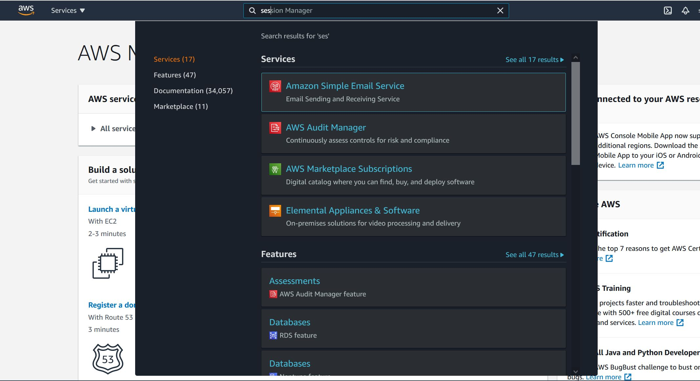

# py-basic-ses
py-basic-ses provides a command line application and library to send emails via Amazon Web Services' Simple Email Service, or AWS SES, API by leveraging the boto3 library.  

**This package requires**

 - Linux or Windows 10
 - Python 3.8, 3.9, or 3.10
 - Dependencies that will install with this package:
     - boto3 (and its dependencies)
     - click (and its dependencies)
 - AWS account with:
     - SES setup correctly
     - An IAM user with access to send email via SES
 - AWS IAM credentials stored appropriately on the machine that is running this application/library

## How to install

Use the PIP package manager to install this application from pypi.org by running the following command  
`pip install py-basic-ses`

## AWS SES Overview

AWS's Simple Email Service (SES) allows email to be sent from your custom domain without the hassle or barriers of setting up a mail server (I've tried this a couple of times, and it is a huge pain to do on a small scale). SES provides support for DKIM (helps your emails land in the inbox rather than the spam folder) and custom MAIL FROM address (the envelope sender/return path will be your domain rather than @us-west-2.amazonses.com).

In order to use the py-basic-ses application or library, you do have to setup the SES service in your AWS account. You will need to obtain your IAM access ID and secret key, and set the appropriate policies. More information on setting up SES and retrieving your required credentials can be found in the **Setting up SES, IAM users, and policies** section of this README.

You can learn more about AWS SES <a href='https://aws.amazon.com/ses/'>here</a>.

## Credentials

In order for the py-basic-ses command line application or library to work, you have to make your AWS IAM access ID and secret key available on the machine running py-basic-ses. Your access ID will look something like `BKIAYPKAJ70YPSLMJ9BZ`, and your secret key will look something like `7GRwZHFWy8DHpqNXZTgcvSaY/T9/nZ+6Xm1E9FxS`.

You have two options for storing your ID and secret key:

 1) Store your ID and secret key in the environment variables AWS_ACCESS_KEY_ID and AWS_SECRET_ACCESS_KEY respectively.

 2) Create a file named credentials, without any extension, and save the following information in it:

 ```    
        [default]
        aws_access_key_id = your-access-key-here
        aws_secret_access_key = your-secret-access-key-here
 ```
 
 For Windows, save your credentials file at `C:\Users\<user name>\.aws\credentials`. For Linux, save your credentials file at `~/.aws/credentials`.  

 To get help retrieving your credentials, see the **Setting up SES, IAM users, and policies** section of this README.

## Command line application

With py-basic-ses installed you will have two commands available from the terminal: `send-test` and `send-email`. `send-test --help` and `send-email --help` will display the availale options with explanations.  

Below are examples of commands for sending a test email and sending a production email.  

Remember, you need to have your credentials stored properly on your machine. See the **Credentials** section of this README for more details.
<br>

**Sending a test email**  
```
send-test --to to-user@to-domain.com --fromaddr from-user@from-domain.com --awsregion your-aws-region
```  
Where `your-aws-region` is the region your SES service is operating in. An example would be `us-west-2`.  

<br>

**Sending a production email**  
```
send-email --to to-user@to-domain.com --fromaddr from-user@from-domain.com --fromname 'From User' --awsregion your-aws-region --subject 'Email Subject' --message_txt 'Email plain text message' --message_html '<h1>HTML Email Heading</h1><p>Email html message</p>'
```
Where `your-aws-region` is the region your SES service is operating in. An example would be `us-west-2`.  
The `send-email` command will send a two part message with html as the primary email body, and a plain text alternative email body. If only `--message_txt` is provided, the plain text will be put in both the html and plain text sections of the email. Not all arguments are required. Run the `send-email --help` command to see the list of arguments, and whether they are required or optional.

## Library

Below is a code sample demonstrating how you would send an email using py-basic-ses. Remember, you need to have your credentials stored properly on your machine. See the **Credentials** section of this README for more details.

```
# import the SESSender class
from py_basic_ses.emailing import SESSender

def ses_send_email():
    to_email_address = "to-user@to-domain.com" 
    from_email_address = "from-user@from-domain.com"
    email_from_name = "From User"
    email_message_txt = "This is an awesome email message."
    email_message_html = "<h1>Awesome Email</h1><p>This is an awesome html formatted email.</p>"
    email_subject = "Awesome Subject"
    ses_aws_region = "us-west-2"


    # instantiate the SESSender object
    ses_send_obj = SESSender(sendto=to_email_address,           # Required
                            fromaddr=from_email_address,        # Required
                            fromname=email_from_name,           # Optional
                            message_txt=email_message_txt,      # Required
                            message_html=email_message_html,    # Optional
                            msgsubject=email_subject,           # Optional
                            aws_region=ses_aws_region)          # Required

    # validate the arguments and credentials before trying to send our email using the ses_validate method
    check_validation = ses_send_obj.ses_validate()
    if check_validation == False:
        return

    # if everything validated, try to send the email
    print("Attempting to send an email to {0}".format(to_email_address))
    ses_send_obj.send_email()


if __name__ == "__main__":
    ses_send_email()
```

## Dev and testing

### Install for dev

py-basic-ses has addiitonal dependencies when installed for dev. To install the package for development, clone the repository, move into the root of the project, and run `pip install -e .[dev]`. This will install the __mock__ and __coverage__ packages for testing. The -e flag makes the package editable while installed. Note the lack of a space beetween the `.`. and `[dev]`.

### Testing

py-basic-ses utilizes __unittest__ to run unit tests. __unittest__ is not included in the `extras_require = ` directive of setup.py, because it is included when Python 3 is installed. The  __coverage__ package allows us to track how much of our code is covered with tests.

To run all of the tests contained in the `tests/` directory, move into the root of the project at `py-basic-ses/`. Then, run `coverage run -m unittest discover -s tests`. This command will look for all of the modules starting with `test_` in the `tests/` directory, and run them using __unittest__.

To see a report of test coverage, run `coverage report -m`. A more nicely formatted report can be generated by running `coverage html`, then opening `htmlcov/index.html` in a browser. For more information on using the coverage package see https://coverage.readthedocs.io/en/coverage-5.5.


## Setting up SES, IAM users, and policies

Getting all of your AWS services, users, and policies setup correctly to send emails via the SES API can be challenging the first time. Below are some notes to help get you going.  

Please, checkout Amazon's <a href='https://docs.aws.amazon.com/ses/latest/DeveloperGuide/send-email-set-up.html'>docs</a> as well. They are much more detailed.

**At a high level, here is what needs to be done:**
 - Create an Amazon Web Services account
 - Register your domain (AWS's Route 53 makes this pretty easy)
 - SES setup
    - Verify your domain by adding txt records to your DNS hosted zone <a href='https://docs.aws.amazon.com/ses/latest/DeveloperGuide/verify-domain-procedure.html'>Amazon's verify domain instructions</a>
    - Setup DKIM by adding three CNAME records to your DNS hosted zone
    - Enable your account for sending email - get out of the sandbox <a href='https://docs.aws.amazon.com/ses/latest/DeveloperGuide/request-production-access.html'>Amazon's get out of the sandbox instructions</a>
 - IAM setup
    - Create a new user
    - Get credentials - This is the access ID and secret key mentioned in the **Credentials** section of this README.
    - Create the proper policy for your IAM user to send emails from your SES  

Below is each step with screen shots and more detailed instructions.


### Create an Amazon Web Services account

Sorry, not going to walk you through this. Go to aws.amazon.com and register.

<br>

### Register your domain

You will need to own and control the domain you want to send email from. AWS offers registration and DNS services through their Route 53 offering. Just search for Route 53 once you are logged into the AWS mangement console. You can also register your domain from another registrar, but it is convenient to have everything under one account. Also, AWS DNS entries propogate very quickly, like in a couple of minutes. I have had to wait for up to 20 - 30 minutes with another registrar.

<br>

### SES Setup

After logging into the AWS management console. Type 'SES' into the search bar in the top nav bar, and click on Amazon Simple Email Service.  




Once you are in the SES Management Console (you will see SES Home at the top of the left navigation panel), you will need to select the region you want your SES service to operate in. Each region reprsents an AWS data center's geogrphic location. Notice the labels next to each geographic description: us-east-1, us-east-2, us-west-1, and so on. These are the region identifyers that will need to be provided to the py-basic-ses command line application and library, so take note of which one you choose.  


Click on Domains in the left nav panel.  


Click Verify a New Domain


Enter your domain (can be a subdomain), check the box next to Generate DKIM Settings, and click Verify This Domain.


You will see the TXT DNS record you need to add to your domain to verify that you own it. If you used Route 53 to register your domain, go into your domain's hosted zone and add the TXT record.  

You will also see three CNAME records that are needed for DKIM. There are three. Be sure to scoll in the DKIM section. Again, if you used Route 53, add these CNAME records to your domain's hosted zone.


After closing the modal with the verification information, you will see your domain listed in the SES Management Console with pending verification next to it. It will take a few minutes for SES to recognize the TXT and DKIM records you just added. Once your domain is verified, you will see 'verified' in green next to your domain.  

Being verified isn't enough. SES puts all new SES accounts in the Amazon SES sandbox. This means you can only send to verified email addresses and domains, and from verified email addresses and domains. This might be fine if you just want to email yourself, but if you need to send to other domains and email addresses outside of your control, you will want to get out of the sandbox. You can read the documentation from Amazon <a href="https://docs.aws.amazon.com/ses/latest/DeveloperGuide/request-production-access.html">here</a>.  


<br>
<br>

### IAM setup

IAM stands for Identity and Access Management. With the IAM Mangement Console you can create users, grant them access to APIs, and even allow them to log in to the AWS Mangement console.

Before we create our new user, we need to take note of the ARN, or Amazon Resource Name of our domain in SES. Amazon identifies each resource with a unique identifyer - its ARN. We will need this in order to create the policy for our user later. To see the ARN for your domain in SES, click on the domain. 


Search for IAM in the top nav bar, and click IAM.  


Click the Users link in the left nav panel.  


Click Add User.  


Enter your user name and select the check box next to Programmatic Access. Obviously, fill in the user you want, not the one in the screen shot.  


Click Next: Tags without setting up any permissions. We will handle permissions later. Then click Next: Review without adding tags. Finally, click Create User. You will see a one-time only screen to collect your credentials. DO NOT CLICK CLOSE until you have stored your Access Key ID and Secret access key.  


You will now add the permissions required for the user you just made to send emails from the domain you setup in SES. Click on Users in the left nav panel. Then, click on the user you just made. Under Permissions policies, click Add inline policy.  

  

In the Create Policy, click the JSON tab. Copy and paste the example SES policy json below into the json editor. Change the ARN listed after `"Resource":` to the ARN of your domain in SES. Also, change the value after `"ses:FromAddress":` to whatever email you want to limit your new IAM user to when indicating the email from address. You can remove this restriction, and allow the user to send from any email by removing the entire `"Condition":` object and its sub-objects from the JSON editor. There are many other permissions that could be added to the `"Action":` object, but this policy just allows the user to send emails and raw emails.  

  

**Example SES policy json**

```
{
    "Version": "2012-10-17",
    "Statement": [
        {
            "Sid": "uniquestring",
            "Effect": "Allow",
            "Action": [
                "ses:SendEmail",
                "ses:SendRawEmail"
            ],
            "Resource": "arn:aws:ses:us-west-2:580492328624:identity/py-basic-ses.domain.com",
            "Condition": {
                "StringEquals": {
                    "ses:FromAddress": "from-user@py-basic-ses.domain.com"
                }
            }
        }
    ]
}
```

Click Next without adding tags. Finally, enter a name for your policy, and click create policy.


That should be it. Your user should now be able to send email using the SES API for your domain.

## Release notes

### v0.1.2
 - Added support for python 3.10
 - Added a .gitlab-ci.yml file for automated testing and publishing

### v0.1.3
 - Added python 3.10 programming language classifier to setup.py
